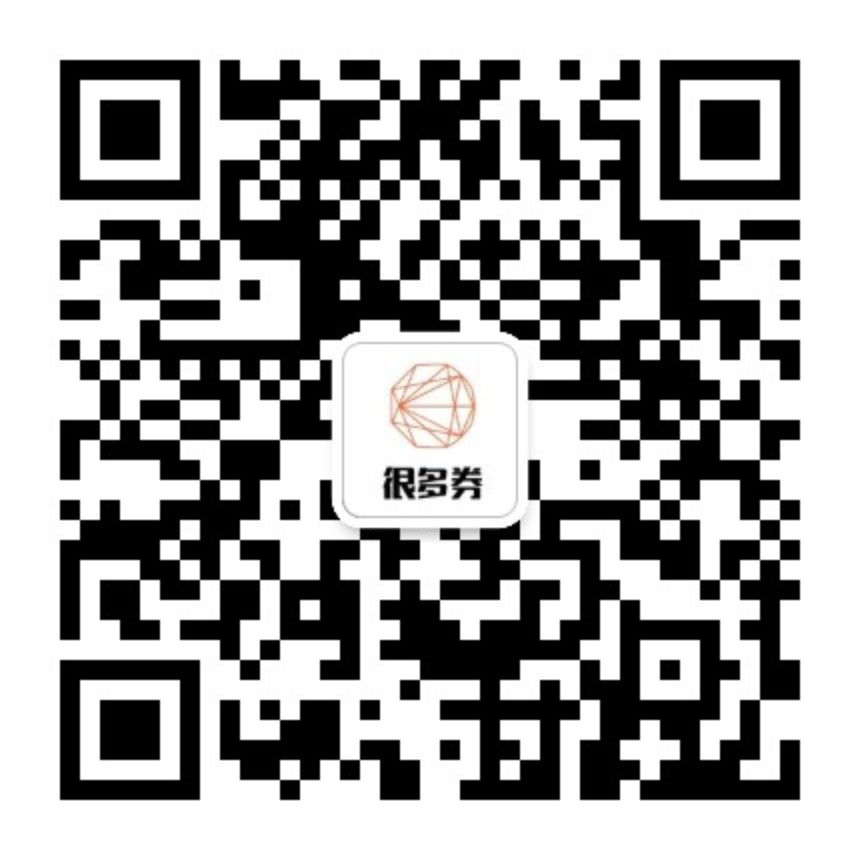
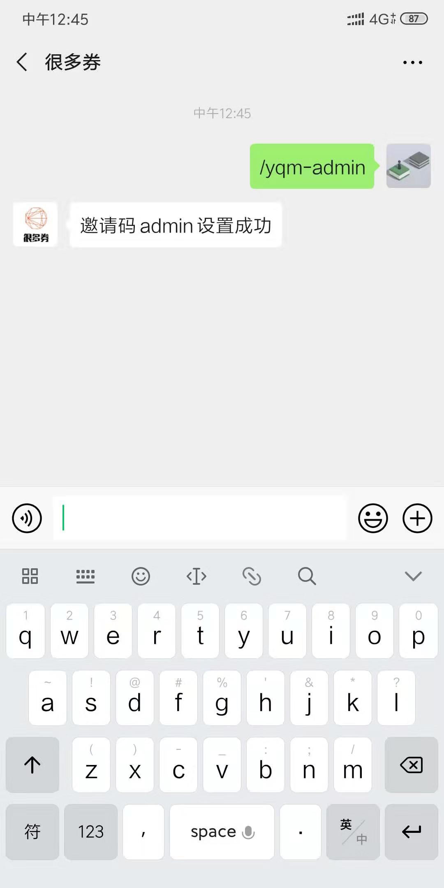
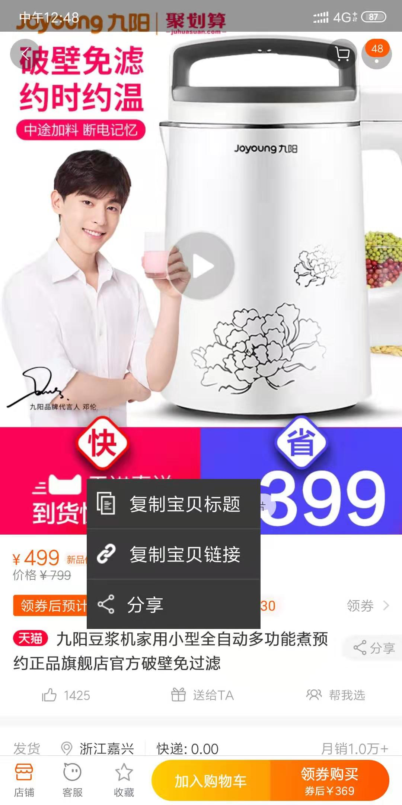
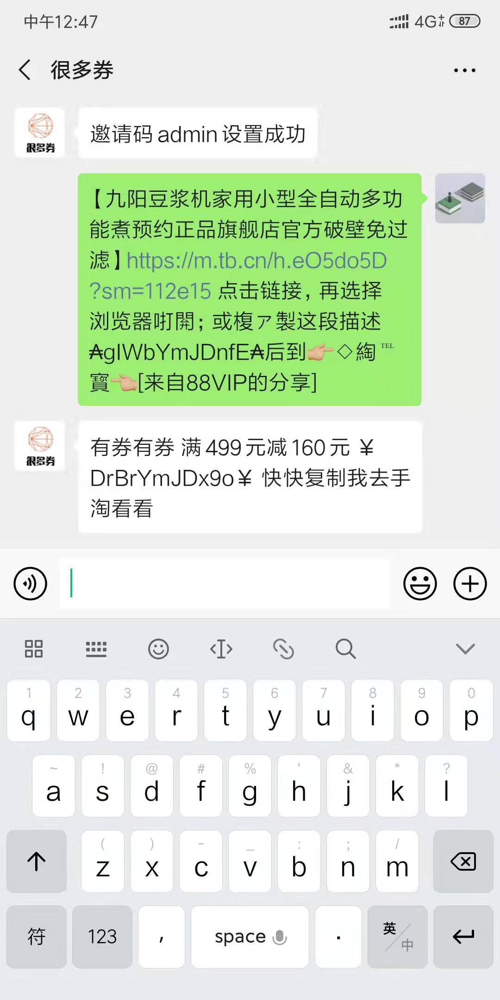
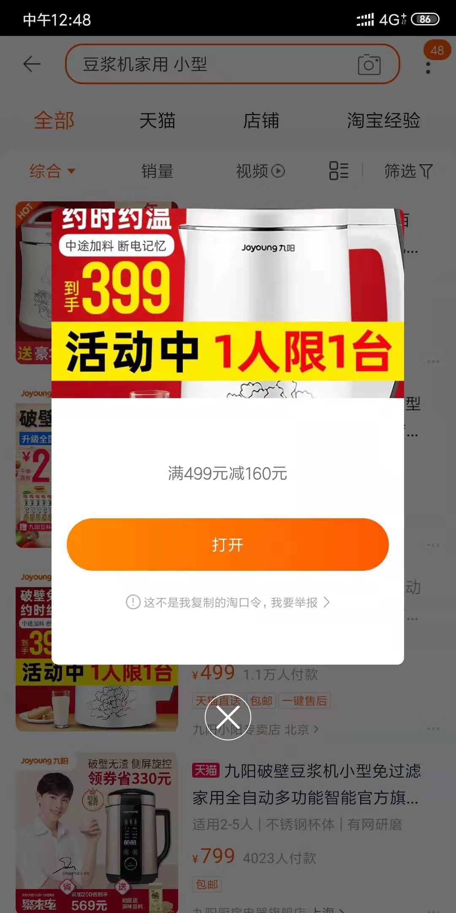
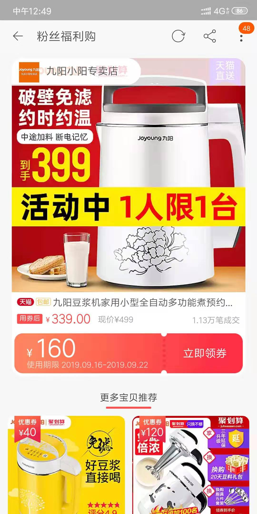

1. 扫码关注

    

2. 输入邀请码绑定

    参考下图所示

    

    绑定完毕后就可以使用这个机器人查询优惠券了

3. 如何使用

    3.1 长按宝贝标题，在弹出的菜单中选择*复制宝贝链接*

    

    3.2 在微信中，把刚才复制的内容发送给这个公众号，如果有优惠券，公众号会回复如下内容

    

    3.3 复制如下内容，再次打开手机淘宝，会弹出如下内容

    

    3.4 点击打开去领取优惠券就好啦~

    
